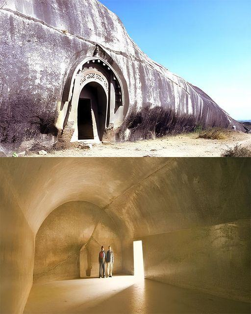

alias:: Barabar, Barabar Hills Caves, Barabar & Nagarjuni Caves
tags:: #precision #megalith 
place:: Bihar
country:: #India 
place-type:: #[[ancient site]] 
project:: #[[Adam's Atlas]] 
nearest-town:: Patna
map-url:: https://maps.app.goo.gl/vpfvEAMisWiWELqv7

- Nagarjuni caves at same site
- From Facebook, Weird, Fantastic and Old Things in Asia group
  collapsed:: true
	- Ancient Perfection: The Mystery of the Barabar Caves
	- The Barabar Hill Caves are some of the oldest surviving rock-cut caves found in India, around 40km (25 miles) from Bodh Gaya in the state of Bihar. Mainly there are four caves: Karan Chaupar, Lomas Rishi, Sudama, and Visvakarma.
	- They are carved from granite, and monolithic rock and are supposed to have been constructed by Emperor Ashoka. Additionally, there are three more caves in the Nagarjuna Hills. They have inscriptions that give the names of the kings they were built for (or under). The oldest is thought to date back to the 3rd century BC.
	- The caves themselves were used by ascetics from the Ajivika, an Indian philosophy dating from the 5th century. These are people who would abstain from sexual gratification in order to pursue spiritual goals.
	- The movement was founded by Makkhali Gosala, a contemporary of Buddha. Thus, it is no surprise that there are also Buddhist and Hindu sculptures from later periods.
	- Most of the caves are made up of two chambers carved from stone. The surfaces are well-polished as are the decorations that adorn the chambers. But the effort to construct them in this way would have been immense: why were they carved out of solid rock?
	- The Barabar caves have greatly influenced the tradition of rock-cut architecture across the Indian subcontinent.
	- Adama cave was dedicated by a Mauryan Emperor named Ashoka in 261 BC. The Mauryan empire ruled a huge swathe of India in the Iron Age and lasted from around 322 to 185 BC. The arches of this cave are more of a bow shape and consist of a vaulted chamber with a circular shape and a pillared rectangular hall. It is also located on the Southern side of the granite hill.
	- The cave was likely the first one and is adorned with an inscription in Brahmi using the name Priyadarsin, meaning “He who brings joy”. One of the most interesting characteristics of this cave is the fact that the interior walls are perfectly flat and polished. It creates a mirror effect on the stone and allows the sound to bounce off the walls quite dramatically. The effect creates an amplified echo which may have been used to enhance the songs of monks or religious ceremonies.
	- Source: Kurt Readman
	- 
	-
- [BARABAR - Breathtaking Precision and Geometry Discovered in Ancient Indian Granite Caves - YouTube](https://www.youtube.com/watch?v=6RJ3Epd_SXk) #UnchartedX
- [Barabar Cave Temples | The Impossible Precision of Ancient India | Megalithomania Documentary Part 1 - YouTube](https://www.youtube.com/watch?v=KzZ00BEeY-M) #[[Megalithomania UK]]
- [Precision Impossible | Barabar Documentary Part 2 | Nagarjuni Caves, India | Megalithomania - YouTube](https://www.youtube.com/watch?v=cyOC-abshCw) #[[Megalithomania UK]]
- [Barabar Caves: Lost technology of Ancient INDIA | Harry Sahota - YouTube](https://www.youtube.com/watch?v=4nGnA0ZrwEk)
- [🔊Sonar Proves Barabar Caves Were 'Perfectly Cut?' - YouTube](https://www.youtube.com/watch?v=VWaxeD3jqGE)
-