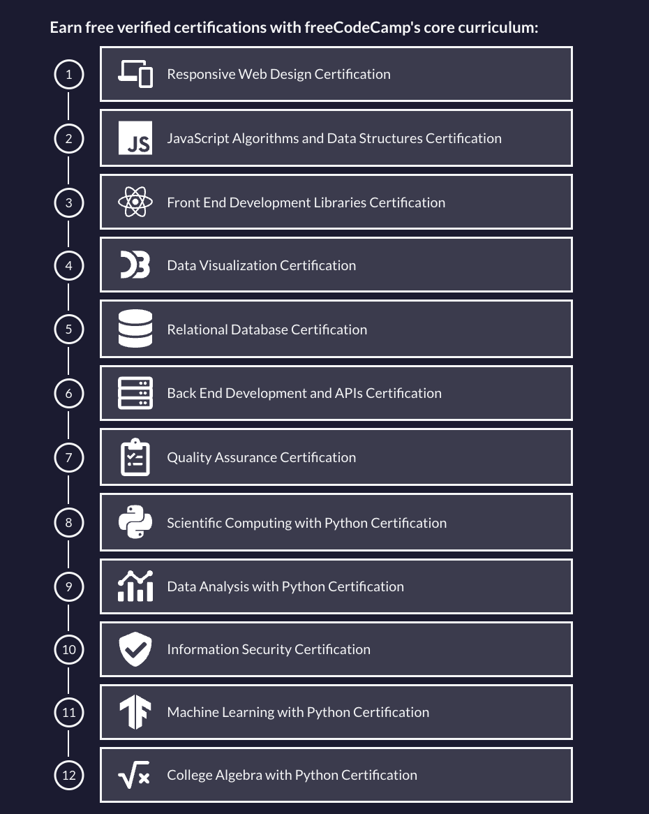

- #[[WADS study]]
- [Learn to Code — For Free — Coding Courses for Busy People](https://www.freecodecamp.org/)
- free courses and certifications in almost all languages and apps
- learning pathways with projects
-
- responsive web design
- javascript
- front end libraries (react, angular, nodejs?)
- SQL
- APIs
- Python
- 
-