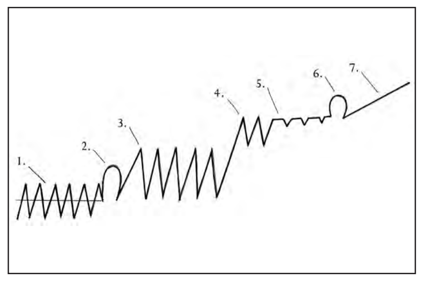

alias::
author:: [[Peace Pilgrim]] 
publication-year::
tags:: book, reference, #keyResource #[[the spiritual journey]]
project:: [[Inner Beginner]], [[EFA]] 
question::
public:: true

-
- ### Spiritual Journey of Peace Pilgrim
- 
- 1. The ups and downs of emotion within the self-centered nature.
- 2. The first hump of no return: Complete willingness, without reservation, to give life to serve the higher will.
- 3. Battle between the God-centered nature and the self-centered nature.
- 4. First peak experience: A glimpse of inner peace.
- 5. Longer and longer plateaus of inner peace.
- 6. Complete inner peace.
- 7. Continuation of growth on a steadily upward path.
-